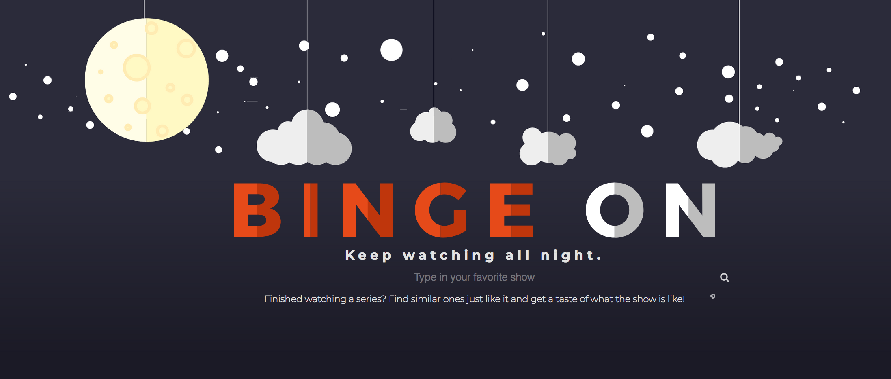

<h1>BingeOn</h1>
<a href="https://mosef.github.io/BingeOn/">BingeOn</a>

Binge on is a simple app that helps you find shows similar
  to the ones you watch. It uses the TasteDive API and the YouTube API

<h2>Technology</h2>
<h3>Front End</h3>
<ul>
  <li>JavaScript</li>
  <li>jQuery</li>
  <li>HTML5</li>
  <li>CSS3</li>
</ul>
